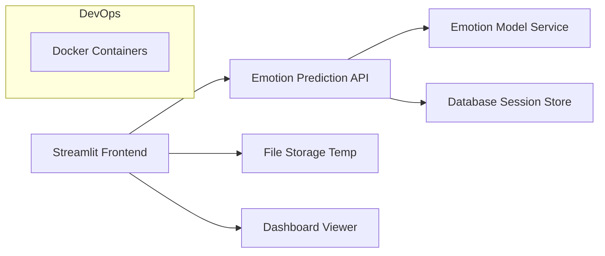

# STUDYSENSE — Adaptive AI-powered Study Platform

**STUDYSENSE** is a Streamlit app that classifies a user's emotion in real-time and adapts the app's theme and study experience accordingly. It’s built for private, focused studying with a dark theme by default and supports a Study Mode that accepts PDFs and runs emotion detection via a backend API.

## Features
- Dark-themed UI with emotion-based dynamic theming.
- Pages:
  - **Login Page** — username + password
  - **Create Account Page** — username + password + confirm password
  - **Home Page** — project overview & navigation
  - **Study Mode Page** — upload PDF, accept a privacy notice, camera activates to capture user images for emotion prediction
  - **Dashboard Page** — history of study sessions and emotion logs
- Emotion prediction served by a backend API (`/predict_emotion`)
- PDF rendering in-page for study sessions
- Privacy-first: Study Mode requires an explicit privacy notice acceptance before camera activation

## Architecture

# Emotion Detection Model

The Emotion Detection Model powers DAIP’s adaptive study experience by analyzing facial expressions and classifying emotions.

# Model Overview

Architecture: Custom CNN Architecture

Framework: Tensorflow

Dataset: FER-2013 

Input: Real-time webcam frames (24×24 grey)

Output Classes:

Happy 😊

Sad 😢

Angry 😠

Surprise 😲

Neutral 😐

Fear 😨

Disgust 😞

# Preprocessing

Crop and resize to 24×24

Normalize using ImageNet mean and std

Convert to tensor and pass to model

# API Endpoint
Served using FastAPI at /predict_emotion

